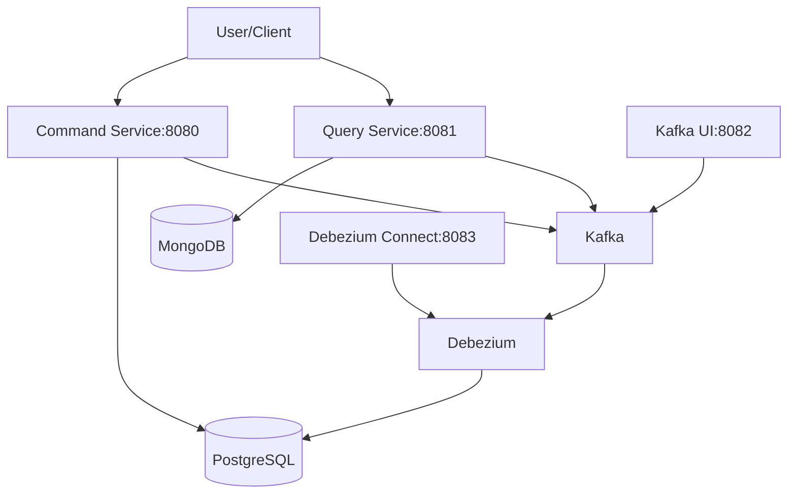
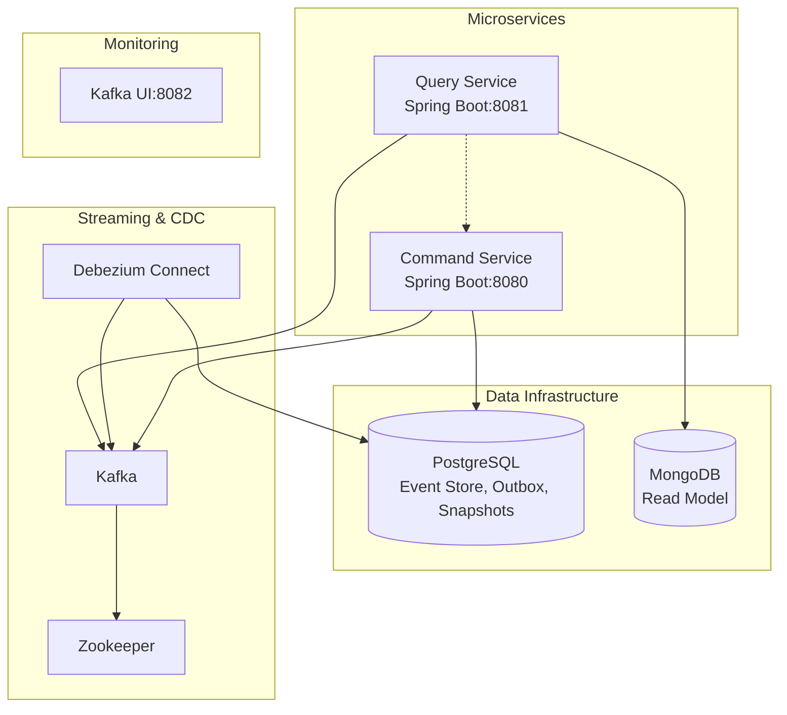
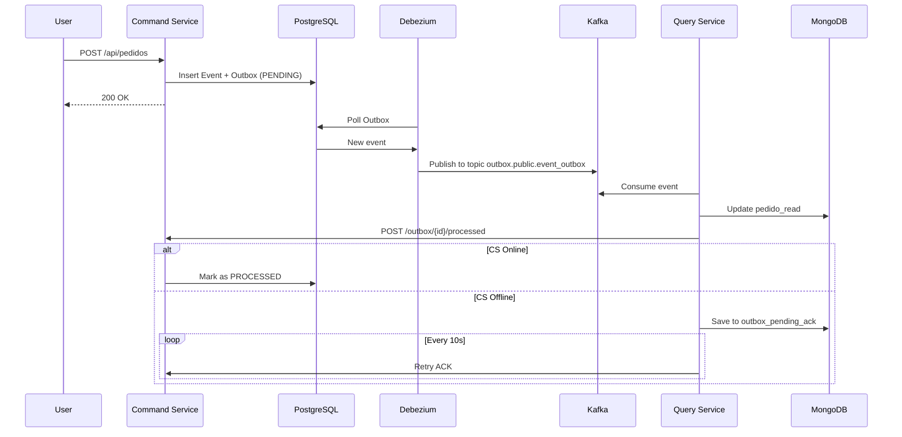

# 📦 Event Sourcing Project (Microservices) — Query Service (MongoDB Branch)

This project implements **DDD + Event Sourcing + CQRS + Outbox Pattern (with CDC via Debezium)** in a microservices-based architecture.  
Currently, the **Query Service** uses **MongoDB** as the database for the **Read Models** (previously PostgreSQL).
- **Command Service (8080):** Responsible for processing commands and storing events in PostgreSQL.
- **Query Service (8081):** Maintains a *read model* in MongoDB and exposes optimized queries.

Events are propagated via **Debezium + Kafka**, ensuring consistency between writes and reads.

---

## Language
- [Portuguese version of the README content](README_PT.md) <br/>
- [English version of the README content](README_EN.md)

---

## ⚙️ Architecture Diagram

### 🏗️ Context Diagram (C4 Level 1)

**System:** Event Sourcing Project (Microservices).<br/>
**Purpose:** Show the system in its external context.

**Legend:**
- **User/Client:** Interacts with the services via REST.
- **Command Service:** Processes commands and stores events.
- **Query Service:** Provides optimized queries based on the read model.
- **PostgreSQL:** Event Store + Outbox + Snapshots.
- **MongoDB:** Read Model (`pedido_read`).
- **Kafka:** Messaging layer for events.
- **Debezium:** CDC to capture changes in PostgreSQL.
- **Kafka UI / Debezium Connect:** Monitoring tools.
  
---

### 🧱 Container Diagram (C4 Level 2)


---

### 🔀 Sequence Diagram: Order Creation Flow

---

### 1. **Command Service**
- Persists events in the **Event Store** (PostgreSQL).
- Registers events in the **Outbox** table (`event_outbox`).
- Generates snapshots of aggregates in `snapshot_store`.
- Exposes the endpoint `/outbox/{id}/processed` to confirm the processing of events in the Query Service.

### 2. **Debezium**
- Monitors the **Outbox** table (`event_outbox`) in PostgreSQL.
- Publishes changes to the Kafka topic `outbox.public.event_outbox`.

### 3. **Query Service (MongoDB)**
- Consumes events from Kafka via `KafkaEventConsumer`.
- Projects data into `pedido_read` in MongoDB.
- Confirms event processing by calling the Command Service (`/outbox/{id}/processed`).
- If the Command Service is **offline**, saves the event in `outbox_pending_ack`.
- The `OutboxAckRetryJob` resends pending ACKs every 10 seconds when the Command Service is back online.

### 4. **Snapshots**
- `AggregateRebuildService` (in the Command Service) allows rehydrating aggregates from the **Event Store** or from **Snapshots**.

### 5. **Queries**
- The **Query Service** exposes REST endpoints that query MongoDB directly.
- Example read models:  
  - `pedido_read` → optimized order view.
  - Aggregated queries (customer statistics, total spent, order status, etc).

---

## 🗄️ Database Structure

### PostgreSQL (Command Service)

| Table                  | Description                                                                 |
|------------------------|-----------------------------------------------------------------------------|
| `event_outbox`         | Implements the **Outbox Pattern** – pending events to be published.         |
| `event_store`          | Stores all system events (append-only).                                     |
| `flyway_schema_history`| Tracks database versioning and migration history.                           |
| `snapshot_store`       | Stores **snapshots** of aggregates for fast reconstruction.                 |

### MongoDB (Query Service)

| Collection             | Description                                                                 |
|------------------------|-----------------------------------------------------------------------------|
| `pedido_read`          | **Read Model** optimized for order queries (CQRS).                         |
| `outbox_pending_ack`   | Stores pending ACKs when the Command Service is **offline**.               |

📌 **ACK Flow**:  
- The **Query Service** consumes events from Kafka → persists them to `pedido_read`.  
- It attempts to call the Command Service → `/outbox/{id}/processed` to mark the event as `PROCESSED`.  
- If the Command Service is **offline**, the event is saved in `outbox_pending_ack`.  
- The `OutboxAckRetryJob` reprocesses periodically until successful when the Command Service comes back online.  

---

### 🗃️ Data Model Diagram

#### PostgreSQL (Command Service)
| Table | Main Fields |
|-------|-------------|
| `event_outbox` | id, aggregate_id, event_type, payload, status, created_at |
| `event_store` | id, aggregate_id, version, event_type, payload, timestamp |
| `snapshot_store` | aggregate_id, version, snapshot_data, created_at |
| `flyway_schema_history` | version, description, script, installed_on |

#### MongoDB (Query Service)
| Collection | Main Fields |
|-----------|-------------|
| `pedido_read` | _id, pedidoId, clienteId, status, items[], total, createdAt |
| `outbox_pending_ack` | _id, outboxId, aggregateId, retryCount, lastAttempt |

---

## 📂 Branch Structure

# ❗ ATTENTION -> IMPORTANT!!!
👉 Use the current branch **mongodb**, not the **main** branch!
- **main** → original version with PostgreSQL in both services.
- 👉 **mongodb** → current branch, where the Query Service uses MongoDB.

---

## 📂 Service Structure
- `command-service/` → Processes commands, applies business rules and publishes events.
- `query-service/` → Consumes events from Kafka and updates MongoDB.
- `docker/` → Startup configuration files.

---

## 🔧 Technologies
- **Spring Boot 3.x** (Framework for developing Java applications)
- **PostgreSQL** (Relational database for Event Store, Snapshots, Outbox)
- **Flyway** (Database migration tool)
- **MongoDB** (NoSQL database for Read Model)
- **Kafka + Zookeeper** (Event streaming platform for asynchronous communication between services)
- **Debezium** (Change Data Capture (CDC) platform to publish Outbox events to Kafka)
- **Lombok** (Library to reduce boilerplate code)
- **Jackson** (JSON handling library)
- **Kafka UI** (Interface to inspect topics)
- **Testcontainers** (For integration tests with real infrastructure in containers)
- **Docker Compose** (Tool to simplify running multi-container Docker applications)

---
## ▶️ How to Run

### First, clone the project!

## ⚙️ Execution Profiles
### ▶️ Run infrastructure + app services (all dockerized)
```bash
docker-compose -f docker-compose.yml -f docker-compose.override.yml up -d --build
```

### ▶️ Run only the infrastructure in Docker + apps locally (Maven)
```bash
docker-compose -f docker-compose.yml up -d

# Command Service
cd command-service
mvn spring-boot:run -Dspring-boot.run.profiles=local

# Query Service
cd query-service
mvn spring-boot:run -Dspring-boot.run.profiles=local
```


📌 **Profile configuration in `application.yml`:**
```yaml
spring:
  profiles:
    active: local   # To run locally
    #active: docker # To run in containers
```

---

## 🎞️ Snapshot Configuration

The snapshot creation frequency is configured in `command-service/src/main/resources/application.yml`:

```yaml
app:
  event-store:
    snapshot-frequency: 2 # A snapshot is created every 2 events (aggregate version multiple of 2)
```
---


## 🔗 Important Access Points
- **Command Service:** [http://localhost:8080/api/pedidos](http://localhost:8080/api/pedidos)
- **Query Service:** [http://localhost:8081/api/pedidos](http://localhost:8081/api/pedidos)
- **Kafka UI:** [http://localhost:8082](http://localhost:8082)
- **Debezium Connect:** [http://localhost:8083](http://localhost:8083)
- **Postgres:** `localhost:5435` (user: postgres / pass: pass)
- **MongoDB:** `localhost:27018` (user: user / pass: pass)

---

## 📡 Main Endpoints

### Query Service
- `GET /api/pedidos/{id}/completo` → Detailed order.
- `GET /api/pedidos/estatisticas/cliente/{clienteId}/total-gasto` → Total spent by customer.
- `GET /api/pedidos?clienteId=...&status=...` → Dynamic filters.

### Command Service
- `POST /api/pedidos` → Create orders.
- `PUT /api/pedidos/{id}` → Update.
- `POST /outbox/{id}/processed` → Confirm processed event.

---

## 🔄 Complete Flow

1. **Command Service** writes event to the **Event Store** and to the **Outbox**.
2. **Debezium** detects changes in `event_outbox` and publishes them to **Kafka**.
3. **Query Service** consumes the event from Kafka → updates **MongoDB** (`pedido_read`).
4. **Query Service** attempts to call `Command Service` → `/outbox/{id}/processed` to confirm **processing** in the **Command Service**.
   - If offline → saves in `outbox_pending_ack`.
   - `OutboxAckRetryJob` reprocesses periodically until successful.
5. Queries are executed directly in **MongoDB** via the Query Service (Read Models).
6. `AggregateRebuildService` and `SnapshotStore` ensure efficient aggregate rehydration.

---

## 🔎 Test Scenarios (Postman)

Examples were prepared in **Postman** to interact with the services.

📥 Download the files at the project root:
- [`postman_collection.json`](postman_collection.json)
- [`Event Sourcing.postman_environment.json`](https://github.com/wekers/event-sourcing-project/blob/mongodb/Even%20Sourcing.postman_environment.json)

After importing into **Postman**, you will be able to test:
- Create, update, cancel orders (**Command Service**)
- Query orders by ID, number, customer, status (**Query Service**)
- Statistics and totals spent by customer

---
### 1. Create Order (Command)


```http
POST http://localhost:8080/api/pedidos
```

- Generates `OrderCreated` event (original: `PedidoCriado`)
- `outbox_event.status = PENDING`

### 2. Debezium → Kafka

- Event published in `outbox.public.event_outbox`
- `outbox_event.status = PUBLISHED`

### 3. Query Service

```http
GET http://localhost:8081/api/pedidos/{pedidoId}
```

- Should return the created order in the **read model**.

### 4. Update Order

```http
PUT http://localhost:8080/api/pedidos/{pedidoId}
```

- Generates `OrderUpdated` event (original: `PedidoAtualizado`)
- Query Service reflects the changes

### 5. Change Status

```http
PATCH http://localhost:8080/api/pedidos/{pedidoId}/status
```

Payload:

```json
{ "novoStatus": "CONFIRMADO" }
```

- Read model updated with new status

- Status must follow the sequence:
 - Final status: ENTREGUE (DELIVERED)
   - Timeline:
     - 2025-08-24T17:40:22Z - PENDENTE (PENDING)
     - 2025-08-24T17:40:22Z - CONFIRMADO (CONFIRMED)
     - 2025-08-24T17:40:22Z - EM_PREPARACAO (IN_PREPARATION)
     - 2025-08-24T17:40:22Z - ENVIADO (SENT)
     - 2025-08-24T17:40:22Z - ENTREGUE (DELIVERED)
Example: it cannot go back from ENTREGUE (DELIVERED) to EM_PREPARACAO (IN_PREPARATION)  
or example: from CONFIRMADO (CONFIRMED) directly to ENVIADO (SENT)

### 6. Cancel Order

```http
DELETE http://localhost:8080/api/pedidos/{pedidoId}
```
- **Payload**:
```json
{ "motivo": "Desistência" }
```

- Generates `OrderCancelled` event (original: `PedidoCancelado`)
- Status in read model: `CANCELADO` (CANCELLED)

---

## 📊 System Flow Summary
1. The **Command Service** saves events in **PostgreSQL** (`event_outbox` table).
2. **Debezium** captures the events and publishes to **Kafka**.
3. The **Query Service** consumes the events and updates **MongoDB**.
4. System queries are executed directly via the **Query Service**.

---


## 📊 Complete Test Report

### 🟢 Command-Service
**Summary:** 57 tests executed — **57 passed ✅**

#### 🔹 Unit Tests
**PedidoCommandServiceTest**
- shouldCreateOrderSuccessfully()
- shouldThrowExceptionWhenUpdatingOrderInInvalidState()
- shouldPropagateConcurrencyExceptionWhenUpdatingStatus()
- shouldUpdateOrderStatusWithFullFlow()
- shouldReturnCurrentVersion()
- shouldCancelOrder()
- shouldUpdateExistingOrderWithRealDomain()
- shouldWrapUnhandledErrorsInIllegalArgumentException()
- shouldNotCreateOrderWithNullRequiredFields()
- shouldThrowOrderNotFoundExceptionWhenUpdatingOrder()
- shouldThrowExceptionWhenUpdatingStatusInInvalidState()
- shouldThrowExceptionWhenCancellingOrderInInvalidState()

**PedidoTest (Domain)**
- shouldNotAllowSettingPendingStatusDirectly()
- shouldNotUpdateCancelledOrder()
- shouldRebuildOrderFromHistory()
- shouldNotUpdateOrderOutsidePendingStatus()
- updateStatusShouldCallCorrectMethods()
- emptyOrderShouldHaveNullInitialState()
- shouldNotCancelAlreadyCancelledOrder()
- shouldUpdateOrderSuccessfully()
- shouldCreateOrderWithPendingStatus()
- shouldNotSendOrderThatIsNotInPreparation()
- shouldAllowUpdatingNotesToEmpty()
- shouldAllowUpdatingNotesToNull()
- shouldRebuildHistoryWithAllEvents()
- shouldNotUpdateStatusToInvalidStatus()
- shouldCancelOrderInPreparationOrSent()
- shouldNotStartPreparationForPendingOrder()
- shouldNotAllowExternalModificationOfItemList()
- shouldCancelPendingOrder()
- shouldNotDeliverOrderThatWasNotSent()
- shouldNotCancelDeliveredOrder()
- shouldNotConfirmAlreadyConfirmedOrder()
- shouldFollowFullStatusFlow()
- shouldNotUpdateDeliveredOrder()
- shouldCancelViaUpdateStatus()
- shouldNotUpdateStatusOfCancelledOrder()

#### 🔹 Integration Tests
**PedidoIntegrationTest**
- shouldReturnErrorWhenCreatingOrderWithNullFields()
- shouldUpdateOrderStatus()
- shouldNotUpdateNonexistentOrder()
- shouldReturnCurrentVersion()
- shouldCancelOrder()
- shouldCreateAndPersistOrder()
- shouldNotCancelDeliveredOrder()
- shouldUpdateExistingOrder()

**PedidoCommandControllerTest**
- Should create an order successfully and validate binding
- Should return 409 when updating order with business conflict
- Should return 400 if the order number is null (@NotBlank validation)
- Should update an existing order and validate binding
- Should cancel an existing order and validate binding
- Should return 404 when trying to update a non-existent order and validate empty body
- Should return 400 when passing an invalid enum for newStatus
- Should return 400 when sending a malformed UUID in the pathVar
- Should update order status and validate enum binding

#### 🔹 E2E Tests
- **FullOrderFlowE2ETest** → Create, update, confirm, prepare, send, deliver and cancel order
- **Complex Integration E2E Test** → Create order and verify integration between services
- **Simple Integration E2E Test** → fullOrderFlow()

---

### 🟢 Query-Service
**Summary:** 35 tests executed — **35 passed ✅**

#### 🔹 Unit Tests — PedidoQueryService
- Should fetch full order by number
- Should list orders by customer
- Should handle empty order (no items and no address)
- Should handle order without address
- Should correctly convert PedidoDTO
- Should count orders by customer
- Should list orders by status
- Should count orders by status
- Should fetch order by ID
- Should fetch order by number
- Should fetch full order by ID
- Should handle order without items
- Should return empty when order does not exist

#### 🔹 Unit Tests — PedidoProjectionHandler
- Should process all types of status events
- Should cancel existing order
- Should update existing order status
- Should create new order when receiving PedidoCriado event
- Should throw IllegalStateException if order not found

#### 🔹 Integration Tests — PedidoQueryController
- Should fetch orders by status
- Should fetch orders by customer with pagination
- Should count orders by customer
- Should count orders by status
- Should fetch order by ID successfully
- Should fetch order by number successfully
- Should fetch full order by ID
- Should return 404 when order not found

#### 🔹 Functional E2E Tests — Query Service
- Full flow: Total spent by customer
- Full flow: Fetch orders by status
- Full flow: Fetch order by ID
- Full flow: List all orders
- Full flow: Statistics by status
- Full flow: List orders by customer
- Full flow: Fetch order by number
- Full flow: Fetch full order
- Full flow: Statistics by customer

---
## 🧪 Test Results

Automated **tests** were implemented to ensure robustness in both services:

### ✅ Command Service
- **57 tests executed** (unit, integration and E2E).  
- Coverage includes:
  - Order creation, update, cancellation and status changes.
  - Full flow: create, update, prepare, send, deliver and cancel order.
  - Business rule validations (invalid statuses, required fields, invalid UUID, etc).
  - Integration between services with Query Service.

### ✅ Query Service
- **35 tests executed** (unit, integration and E2E).  
- Coverage includes:
  - Queries by ID, order number, customer and status.
  - Order statistics by customer (total spent, status, quantity).
  - E2E tests consuming events from Kafka, persisting in MongoDB and confirming processing in Command Service.
  - Fallback scenarios when Command Service is **offline**, persisting events in `outbox_pending_ack`.

---

### 📌 Overall Conclusion
- **Command-Service:** 57/57 tests passed ✅  
- **Query-Service:** 35/35 tests passed ✅  
- All **unit, integration and E2E tests** were executed successfully.  
- The **Outbox Pattern + CQRS** flow validated with:
  - **PostgreSQL**:  
    - `event_outbox` → Outbox Pattern (events to publish)  
    - `event_store` → Append-only event storage  
    - `snapshot_store` → Aggregate snapshots  
    - `flyway_schema_history` → Schema version control
  - **MongoDB**:  
    - `pedido_read` → Read Model optimized for queries (CQRS)  
    - `outbox_pending_ack` → Buffer when Command-Service is offline  

> The **Query-Service** calls the `Command-Service /outbox/{id}/processed` endpoint to mark events as processed.  
If the Command-Service is offline → the event is saved in `outbox_pending_ack`.  
When it comes back → `OutboxAckRetryJob` reprocesses automatically.

---

#### 📲 Command-Service Test PrintScreen:


---

#### 📲 Query-Service Test PrintScreen:


---

## ✅ Current Status
- [x] Command Service isolated with PostgreSQL + Debezium
- [x] Query Service with MongoDB as read model
- [x] Kafka UI for monitoring
- [x] Profiles configured to run **local** or **docker**
- [x] API examples available in Postman
- [x] Integration validated with **E2E tests** (with Kafka + Outbox Pattern).  
- [x] Advanced queries in Query Service (statistics, total spent, dynamic filters).  

---
## 📌 Important Notes

- `PedidoReadModel` is annotated with `@Field(..., targetType = FieldType.DECIMAL128)` to save values as `NumberDecimal` and allow aggregations.
- The `mongodb` branch is already isolated from `command-service` — the `query-service` no longer depends on Command classes.

---

✍️ **Author:** Fernando Gilli
