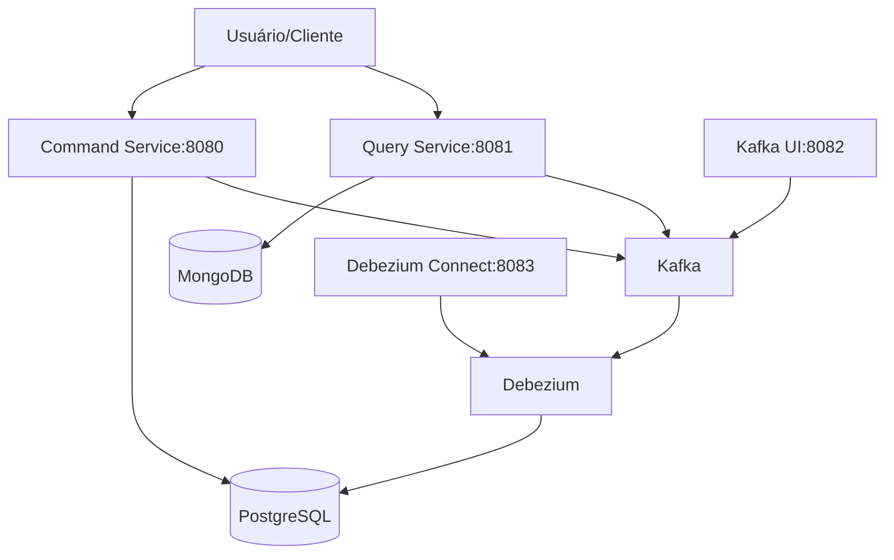
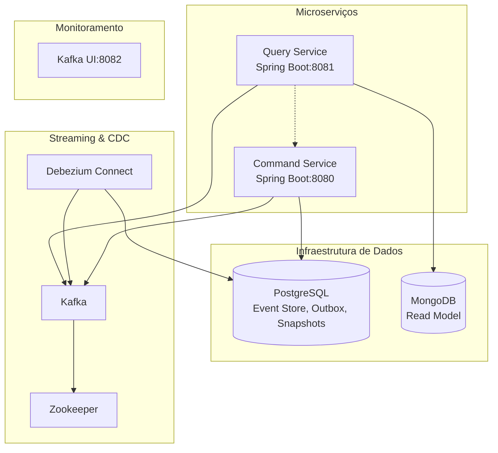
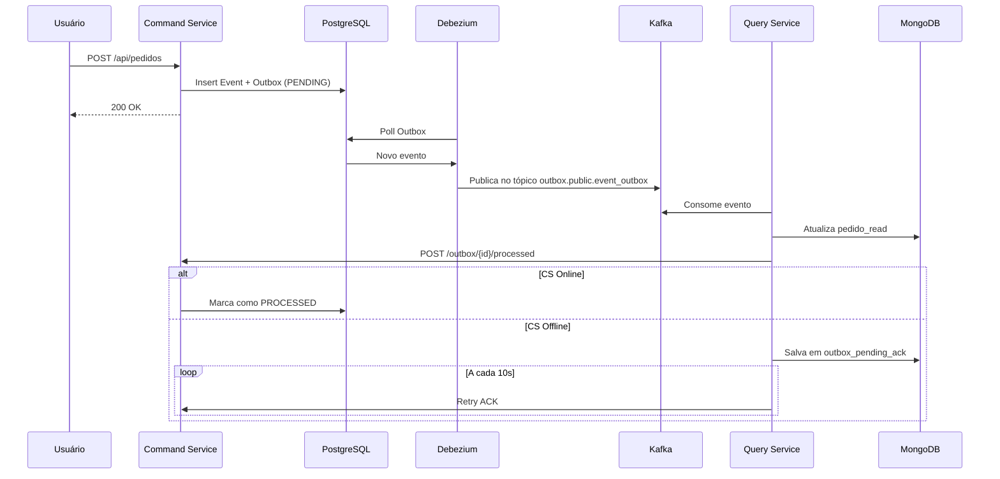

# 📦 Event Sourcing Project (Microserviços) — Query Service no (MongoDB Branch)

Este projeto implementa **DDD + Event Sourcing + CQRS + Outbox Pattern (com CDC via Debezium)** em uma arquitetura baseada em microserviços.  
Atualmente, o **Query Service** utiliza **MongoDB** como banco de dados para os **Read Models** (antes era PostgreSQL).
- **Command Service (8080):** Responsável por processar comandos e armazenar eventos no PostgreSQL.
- **Query Service (8081):** Mantém um *read model* no MongoDB e expõe consultas otimizadas.

Eventos são propagados via **Debezium + Kafka**, garantindo consistência entre escrita e leitura.

---

## Language
- 🇧🇷 Você está lendo a versão em Português.
- 🇺🇸 [English version](https://github.com/wekers/event-sourcing-project/tree/mongodb)
---

## ⚙️ Diagrama de Arquitetura

### 🏗️ Diagrama de Contexto (C4 Nível 1)

**Sistema:** Event Sourcing Project (Microserviços).<br/>
**Propósito:** Mostrar o sistema em seu contexto externo.

**Legenda:**
- **Usuário/Cliente:** Interage com os serviços via REST.
- **Command Service:** Processa comandos e armazena eventos.
- **Query Service:** Fornece consultas otimizadas a partir do read model.
- **PostgreSQL:** Event Store + Outbox + Snapshots.
- **MongoDB:** Read Model (pedido_read).
- **Kafka:** Mensageria para eventos.
- **Debezium:** CDC para capturar mudanças no PostgreSQL.
- **Kafka UI / Debezium Connect:** Ferramentas de monitoramento.
  
---

### 🧱 Diagrama de Contêineres (C4 Nível 2)


---
### 🔀 Diagrama de Sequência: Fluxo de Criação de Pedido

---
### 1. **Command Service**
- Persiste os eventos no **Event Store** (PostgreSQL).
- Registra os eventos na tabela **Outbox** (`event_outbox`).
- Gera snapshots dos agregados em `snapshot_store`.
- Expõe o endpoint `/outbox/{id}/processed` para confirmar o processamento dos eventos no Query Service.

### 2. **Debezium**
- Monitora a tabela **Outbox** (`event_outbox`) no PostgreSQL.
- Publica mudanças no tópico Kafka `outbox.public.event_outbox`.

### 3. **Query Service (MongoDB)**
- Consome eventos do Kafka via `KafkaEventConsumer`.
- Projeta os dados em `pedido_read` no MongoDB.
- Confirma o processamento dos eventos chamando o Command Service (`/outbox/{id}/processed`).
- Se o Command Service estiver **offline**, salva o evento em `outbox_pending_ack`.
- O `OutboxAckRetryJob` reenvia os ACKs pendentes a cada 10s quando o Command Service voltar.

### 4. **Snapshots**
- `AggregateRebuildService` (no Command Service) permite reidratar agregados a partir do **Event Store** ou de **Snapshots**.

### 5. **Consultas**
- O **Query Service** expõe endpoints REST que consultam diretamente o MongoDB.
- Exemplo de read models:  
  - `pedido_read` → visão otimizada de pedidos.
  - Consultas agregadas (estatísticas de clientes, total gasto, status de pedidos, etc).

---

## 🗄️ Estrutura do Banco de Dados

### PostgreSQL (Command Service)

| Tabela                 | Descrição                                                                 |
|-------------------------|---------------------------------------------------------------------------|
| `event_outbox`         | Implementa o **Outbox Pattern** – eventos pendentes a serem publicados.   |
| `event_store`          | Armazena todos os eventos do sistema (append-only).                       |
| `flyway_schema_history`| Controla a versão e histórico de migrações no banco de dados.             |
| `snapshot_store`       | Armazena **snapshots** dos agregados para reconstrução rápida.            |

### MongoDB (Query Service)

| Coleção              | Descrição                                                                                     |
|----------------------|------------------------------------------------------------------------------------------------|
| `pedido_read`        | **Read Model** otimizado para consultas de pedidos (CQRS).                                    |
| `outbox_pending_ack` | Armazena ACKs pendentes quando o Command Service está **offline**.                             |

📌 **Fluxo de ACK**:  
- O **Query Service** consome eventos do Kafka → persiste no `pedido_read`.  
- Tenta chamar `Command Service → /outbox/{id}/processed` para marcar como `PROCESSED`.  
- Se o Command estiver **offline**, salva em `outbox_pending_ack`.  
- O `OutboxAckRetryJob` reprocessa periodicamente até sucesso quando o Command voltar.  

---
### 🗃️ Diagrama de Modelo de Dados

#### PostgreSQL (Command Service)
|Tabela	| Campos Principais   |
|-------|---------------------|
| `event_outbox` | id, aggregate_id, aggregate_type, event_type, event_data (jsonb), created_at, processed_at, status |
| `event_store` | id, aggregate_id, aggregate_type, event_type, event_data (jsonb), version, created_at |
| `snapshot_store` | id, aggregate_id, aggregate_type, aggregate_data (jsonb), version, created_at |
| `flyway_schema_history` | version, description, script, installed_on |

#### MongoDB (Query Service)
|Coleção	| Campos Principais |
|-----------|-------------------|
| `pedido_read` | _id, numero_pedido, clienteId, status, version, itens[], valor_total, data_criacao |
| `outbox_pending_ack` | _id, outbox_event_id, retry_count, created_at |

---
#### 📲 PostgreSQL Diagrama:

---

## 📂 Estrutura de Branches

# ❗ ATENÇÃO -> IMPORTANTE!!!
👉 use a branch atual **mongodb**, não a branch **main**!
- **main** → versão original com PostgreSQL em ambos os serviços.
- 👉 **mongodb** → branch atual, onde o Query Service usa MongoDB.

---

## 📂 Estrutura dos Serviços
- `command-service/` → Processa comandos, aplica regras de negócio e publica eventos.
- `query-service/` → Consome eventos do Kafka e atualiza o MongoDB.
- `docker/` → Arquivos de configuração de inicialização.

---

## 🔧 Tecnologias
- **Spring Boot 3.x** (Framework para desenvolvimento de aplicações Java)
- **PostgreSQL** (Banco de dados relacional para Event Store, Snapshots, Outbox)
- **Flyway** (Ferramenta de migração de banco de dados)
- **MongoDB** (Banco de dados NoSQL para Read Model)
- **Kafka + Zookeeper** (Plataforma de streaming de eventos para comunicação assíncrona entre os serviços)
- **Debezium** (Plataforma de Change Data Capture (CDC) para publicar eventos do Outbox para o Kafka)
- **Lombok:** (Biblioteca para reduzir código boilerplate)
- **Jackson:** (Biblioteca para manipulação de JSON)
- **Kafka UI** (Interface para inspecionar tópicos)
- **Testcontainers:** (Para testes de integração com infraestrutura real em contêineres)
- **Docker Compose** (Ferramenta que simplifica a execução de aplicações com múltiplos contêineres Docker)


---
## ▶️ Como Executar

### Primeiramente faça um clone do projeto!

## ⚙️ Perfis de Execução
### ▶️ Rodar infraestrutura +  serviços apps (tudo dockerizados)
```bash
docker-compose -f docker-compose.yml -f docker-compose.override.yml up -d --build
```

### ▶️ Rodar apenas a infraestrutura no Docker + apps localmente (Maven)
```bash
docker-compose -f docker-compose.yml up -d

# Command Service
cd command-service
mvn spring-boot:run -Dspring-boot.run.profiles=local

# Query Service
cd query-service
mvn spring-boot:run -Dspring-boot.run.profiles=local
```


📌 **Configuração de perfis no `application.yml`:**
```yaml
spring:
  profiles:
    active: local   # Para rodar localmente
    #active: docker # Para rodar em containers
```
---
## 🎞️ Configuração de Snapshot

A frequência de criação de snapshots é configurada no `command-service/src/main/resources/application.yml`:

```yaml
app:
  event-store:
    snapshot-frequency: 2 # Um snapshot é criado a cada 2 eventos (versão do agregado múltipla de 2)
```
---


## 🔗 Acessos Importantes
- **Command Service:** [http://localhost:8080/api/pedidos](http://localhost:8080/api/pedidos)
- **Query Service:** [http://localhost:8081/api/pedidos](http://localhost:8081/api/pedidos)
- **Kafka UI:** [http://localhost:8082](http://localhost:8082)
- **Debezium Connect:** [http://localhost:8083](http://localhost:8083)
- **Postgres:** `localhost:5435` (user: postgres / pass: pass)
- **MongoDB:** `localhost:27018` (user: user / pass: pass)

---

## 📡 Endpoints Principais

### Query Service
- `GET /api/pedidos/{id}/completo` → Pedido detalhado.
- `GET /api/pedidos/estatisticas/cliente/{clienteId}/total-gasto` → Total gasto por cliente.
- `GET /api/pedidos?clienteId=...&status=...` → Filtros dinâmicos.

### Command Service
- `POST /api/pedidos` → Criação de pedidos.
- `PUT /api/pedidos/{id}` → Atualização.
- `POST /outbox/{id}/processed` → Confirmação de evento processado.

---
#### 📲 Listar Pedido Completo - Postman PrintScreen:

---

## 🔄 Fluxo Completo

1. **Command Service** grava evento no **Event Store** e no **Outbox**.
2. **Debezium** detecta mudanças no `event_outbox` e publica no **Kafka**.
3. **Query Service** consome evento do Kafka → atualiza **MongoDB** (`pedido_read`).
4. **Query Service** Tenta chamar `Command Service` → `/outbox/{id}/processed` para confirmar **processamento** no **Command Service**.
   - Se offline → salva no `outbox_pending_ack`.
   - `OutboxAckRetryJob` reprocessa periodicamente até sucesso.
5. Consultas são feitas diretamente no **MongoDB** via Query Service (Read Models).
6. `AggregateRebuildService` e `SnapshotStore` garantem reidratação eficiente de agregados.

---

## 🔎 Roteiro de Testes (Postman)

Foram preparados exemplos no **Postman** para interagir com os serviços.

📥 Baixe os arquivos na raiz do projeto:
- [`postman_collection.json`](postman_collection.json)
- [`Event Sourcing.postman_environment.json`](https://github.com/wekers/event-sourcing-project/blob/mongodb/Even%20Sourcing.postman_environment.json)

Após importar no **Postman**, você poderá testar:
- Criar, atualizar, cancelar pedidos (**Command Service**)
- Consultar pedidos por ID, número, cliente, status (**Query Service**)
- Estatísticas de pedidos e valores gastos por cliente

---
### 1. Criar Pedido (Command)


```http
POST http://localhost:8080/api/pedidos
```

- Gera evento `PedidoCriado`
- `outbox_event.status = PENDING`

### 2. Debezium → Kafka

- Evento publicado em `outbox.public.event_outbox`
- `outbox_event.status = PUBLISHED`

### 3. Query Service

```http
GET http://localhost:8081/api/pedidos/{pedidoId}
```

- Deve retornar o pedido criado no **read model**.

### 4. Atualizar Pedido

```http
PUT http://localhost:8080/api/pedidos/{pedidoId}
```

- Gera evento `PedidoAtualizado`
- Query Service reflete as mudanças

### 5. Alterar Status

```http
PATCH http://localhost:8080/api/pedidos/{pedidoId}/status
```

Payload:

```json
{ "novoStatus": "CONFIRMADO" }
```

- Read model atualizado com novo status


- Status devem seguir a ordem:
 - Status final: ENTREGUE
   - Linha do tempo:
	 - 2025-08-24T17:40:22Z - PENDENTE
	 - 2025-08-24T17:40:22Z - CONFIRMADO
     - 2025-08-24T17:40:22Z - EM_PREPARACAO
	 - 2025-08-24T17:40:22Z - ENVIADO
	 - 2025-08-24T17:40:22Z - ENTREGUE
>ex.: não pode voltar de **ENTREGUE** para **EM_PREPARACAO**  
ou ex.: de **CONFIRMADO** para **ENVIADO** direto

### 6. Cancelar Pedido

```http
DELETE http://localhost:8080/api/pedidos/{pedidoId}
```
- **Payload**:
```json
{ "motivo": "Desistência" }
```

- Evento `PedidoCancelado`
- Status no read model: `CANCELADO`

---
#### 📲 MongoDB Compass PrintScreen:

---

## 📊 Fluxo Resumido do Sistema
1. O **Command Service** salva eventos no **PostgreSQL** (tabela `event_outbox`).
2. O **Debezium** captura os eventos e publica no **Kafka**.
3. O **Query Service** consome os eventos e atualiza o **MongoDB**.
4. As consultas ao sistema são feitas diretamente no **Query Service**.

---


## 📊 Relatório Completo de Testes

### 🟢 Command-Service
**Resumo:** 57 testes executados — **57 aprovados ✅**

#### 🔹 Testes Unitários
**PedidoCommandServiceTest**
- deveCriarPedidoComSucesso()
- deveLancarExcecaoQuandoAtualizarPedidoEmEstadoInvalido()
- devePropagarConcurrencyExceptionAoAtualizarStatus()
- deveAtualizarStatusDoPedidoComFluxoCompleto()
- deveRetornarVersaoAtual()
- deveCancelarPedido()
- deveAtualizarPedidoExistenteComDominioReal()
- deveEncapsularErrosNaoTratadosEmIllegalArgumentException()
- naoDeveCriarPedidoComCamposObrigatoriosNulos()
- deveLancarExcecaoPedidoNotFoundQuandoAtualizarPedido()
- deveLancarExcecaoQuandoAtualizarStatusEmEstadoInvalido()
- deveLancarExcecaoQuandoCancelarPedidoEmEstadoInvalido()

**PedidoTest (Domínio)**
- naoDevePermitirDefinirStatusPendenteDiretamente()
- naoDeveAtualizarPedidoCancelado()
- deveReconstruirPedidoDoHistorico()
- naoDeveAtualizarPedidoForaDoStatusPendente()
- atualizarStatusDeveChamarMetodosCorretos()
- pedidoVazioDeveTerEstadoInicialNulo()
- naoDeveCancelarPedidoJaCancelado()
- deveAtualizarPedidoComSucesso()
- deveCriarPedidoComStatusPendente()
- naoDeveEnviarPedidoQueNaoEstaEmPreparacao()
- devePermitirAtualizarObservacoesParaVazio()
- devePermitirAtualizarObservacoesParaNulo()
- deveReconstruirHistoricoComTodosOsEventos()
- naoDeveAtualizarStatusParaStatusInvalido()
- deveCancelarPedidoEmPreparacaoOuEnviado()
- naoDeveIniciarPreparacaoDePedidoPendente()
- naoDevePermitirModificarListaDeItensExternamente()
- deveCancelarPedidoPendente()
- naoDeveEntregarPedidoQueNaoFoiEnviado()
- naoDeveCancelarPedidoEntregue()
- naoDeveConfirmarPedidoJaConfirmado()
- deveSeguirFluxoCompletoDeStatus()
- naoDeveAtualizarPedidoEntregue()
- deveCancelarViaAtualizarStatus()
- naoDeveAtualizarStatusDePedidoJaCancelado()

#### 🔹 Testes de Integração
**PedidoIntegrationTest**
- deveRetornarErroAoCriarPedidoCamposNulos()
- deveAtualizarStatusPedido()
- naoDeveAtualizarPedidoQueNaoExiste()
- deveRetornarVersaoAtual()
- deveCancelarPedido()
- deveCriarEPersistirPedido()
- naoDeveCancelarPedidoEntregue()
- deveAtualizarPedidoExistente()

**PedidoCommandControllerTest**
- Deve criar um pedido com sucesso e validar binding
- Deve retornar 409 ao atualizar pedido com conflito de negócio
- Deve retornar 400 se o número do pedido for nulo (validação @NotBlank)
- Deve atualizar um pedido existente e validar binding
- Deve cancelar um pedido existente e validar binding
- Deve retornar 404 ao tentar atualizar pedido inexistente e validar body vazio
- Deve retornar 400 ao passar enum inválido para novoStatus
- Deve retornar 400 ao enviar UUID malformado no pathVar
- Deve atualizar status de um pedido e validar binding do enum

#### 🔹 Testes E2E
- **FluxoCompletoPedidoE2ETest** → Criar, atualizar, confirmar, preparar, enviar, entregar e cancelar pedido
- **Teste E2E de Integração Complexo** → Criar pedido e verificar integração entre serviços
- **Teste E2E de Integração Simples** → fluxoCompletoPedido()

---

### 🟢 Query-Service
**Resumo:** 35 testes executados — **35 aprovados ✅**

#### 🔹 Testes Unitários — PedidoQueryService
- Deve buscar pedido completo por número
- Deve listar pedidos por cliente
- Deve lidar com pedido vazio (sem itens e sem endereço)
- Deve lidar com pedido sem endereço
- Deve converter PedidoDTO corretamente
- Deve contar pedidos por cliente
- Deve listar pedidos por status
- Deve contar pedidos por status
- Deve buscar pedido por ID
- Deve buscar pedido por número
- Deve buscar pedido completo por ID
- Deve lidar com pedido sem itens
- Deve retornar vazio quando pedido não existe

#### 🔹 Testes Unitários — PedidoProjectionHandler
- Deve processar todos os tipos de evento de status
- Deve cancelar pedido existente
- Deve atualizar status do pedido existente
- Deve criar novo pedido quando receber evento PedidoCriado
- Deve lançar IllegalStateException se pedido não encontrado

#### 🔹 Testes de Integração — PedidoQueryController
- Deve buscar pedidos por status
- Deve buscar pedidos por cliente com paginação
- Deve contar pedidos por cliente
- Deve contar pedidos por status
- Deve buscar pedido por ID com sucesso
- Deve buscar pedido por número com sucesso
- Deve buscar pedido completo por ID
- Deve retornar 404 quando pedido não encontrado

#### 🔹 Testes Funcionais E2E — Query Service
- Fluxo completo: Total gasto por cliente
- Fluxo completo: Buscar pedidos por status
- Fluxo completo: Buscar pedido por ID
- Fluxo completo: Listar todos os pedidos
- Fluxo completo: Estatísticas por status
- Fluxo completo: Listar pedidos por cliente
- Fluxo completo: Buscar pedido por número
- Fluxo completo: Buscar pedido completo
- Fluxo completo: Estatísticas por cliente

---
## 🧪 Resultados de Testes

Foram implementados **testes automatizados** para garantir robustez em ambos os serviços:

### ✅ Command Service
- **57 testes executados** (unitários, integração e E2E).  
- Abrangem:
  - Criação, atualização, cancelamento e mudança de status de pedidos.
  - Fluxo completo: criar, atualizar, preparar, enviar, entregar e cancelar pedido.
  - Validações de regras de negócio (status inválidos, campos obrigatórios, UUID inválido etc).
  - Integração entre serviços com Query Service.

### ✅ Query Service
- **35 testes executados** (unitários, integração e E2E).  
- Abrangem:
  - Consultas por ID, número do pedido, cliente e status.
  - Estatísticas de pedidos por cliente (total gasto, status, quantidade).
  - Testes E2E consumindo eventos do Kafka, persistindo no MongoDB e confirmando processamento no Command Service.
  - Cenários de fallback quando o Command Service está **offline**, persistindo eventos em `outbox_pending_ack`.

---

### 📌 Conclusão Geral
- **Command-Service:** 57/57 testes passaram ✅  
- **Query-Service:** 35/35 testes passaram ✅  
- Todos os testes de **unidade, integração e E2E** foram executados com sucesso.  
- O fluxo **Outbox Pattern + CQRS** validado com:
  - **PostgreSQL**:  
    - `event_outbox` → Outbox Pattern (eventos a publicar)  
    - `event_store` → Armazenamento append-only de eventos  
    - `snapshot_store` → Snapshots de agregados  
    - `flyway_schema_history` → Controle de versão do schema
  - **MongoDB**:  
    - `pedido_read` → Read Model otimizado para consultas (CQRS)  
    - `outbox_pending_ack` → Buffer quando Command-Service está offline  

> O **Query-Service** chama o endpoint `Command-Service /outbox/{id}/processed` para marcar eventos como processados.  
Se o Command-Service estiver offline → evento é salvo em `outbox_pending_ack`.  
Quando volta → `OutboxAckRetryJob` reprocessa automaticamente.

---

#### 📲 Command-Service Test PrintScreen:


---

#### 📲 Query-Service Test PrintScreen:


---

## ✅ Status Atual
- [x] Command Service isolado com PostgreSQL + Debezium
- [x] Query Service com MongoDB como read model
- [x] Kafka UI para monitoramento
- [x] Perfis configurados para rodar **local** ou **docker**
- [x] Exemplos de API disponíveis no Postman
- [x] Integração validada com **testes E2E** (com Kafka + Outbox Pattern).  
- [x] Consultas avançadas no Query Service (estatísticas, total gasto, filtros dinâmicos).  

---
## 📌 Notas Importantes

- `PedidoReadModel` está anotado com `@Field(..., targetType = FieldType.DECIMAL128)` para salvar valores como `NumberDecimal` e permitir agregações.
- O branch `mongodb` já está isolado do `command-service` — o `query-service` não depende mais de classes do Command.

---

✍️ **Autor:** Fernando Gilli  
